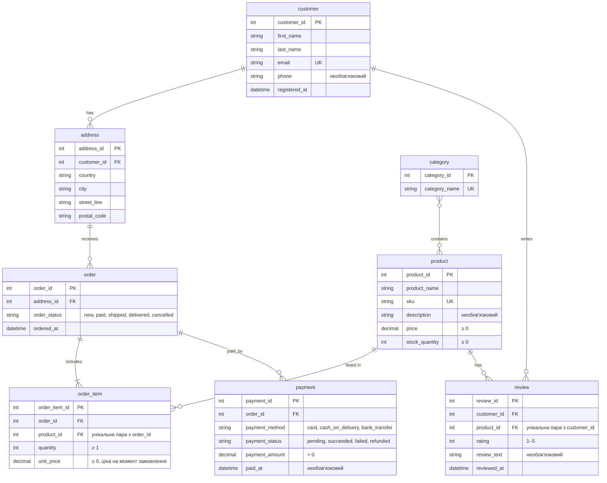

# ER-діаграма «Онлайн-магазин»

Модель за `spec.md`. GitHub малює діаграму автоматично з цього файлу.

```mermaid
erDiagram
    customer ||--o{ address : has
    address ||--o{ order : receives
    category }o--o{ product : contains
    order ||--|{ order_item : includes
    product ||--o{ order_item : "listed in"
    order ||--o{ payment : paid_by
    customer ||--o{ review : writes
    product ||--o{ review : has

    customer {
        int customer_id PK
        string first_name
        string last_name
        string email UK
        string phone "необов'язковий"
        datetime registered_at
    }

    address {
        int address_id PK
        int customer_id FK
        string country
        string city
        string street_line
        string postal_code
    }

    category {
        int category_id PK
        string category_name UK
    }

    product {
        int product_id PK
        string product_name
        string sku UK
        string description "необов'язковий"
        decimal price "≥ 0"
        int stock_quantity "≥ 0"
    }

    order {
        int order_id PK
        int address_id FK
        string order_status "new, paid, shipped, delivered, cancelled"
        datetime ordered_at
    }

    order_item {
        int order_item_id PK
        int order_id FK
        int product_id FK "унікальна пара з order_id"
        int quantity "≥ 1"
        decimal unit_price "≥ 0, ціна на момент замовлення"
    }

    payment {
        int payment_id PK
        int order_id FK
        string payment_method "card, cash_on_delivery, bank_transfer"
        string payment_status "pending, succeeded, failed, refunded"
        decimal payment_amount "> 0"
        datetime paid_at "необов'язковий"
    }

    review {
        int review_id PK
        int customer_id FK
        int product_id FK "унікальна пара з customer_id"
        int rating "1–5"
        string review_text "необов'язковий"
        datetime reviewed_at
    }
```